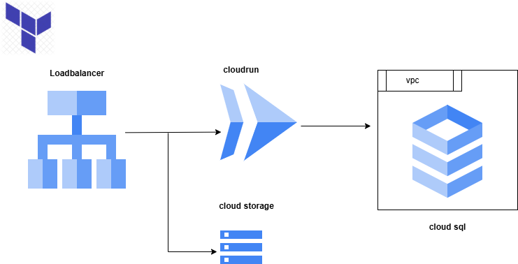

# bluewindowterraform-project

Deploy a 3-Tier PHP App on GCP with Terraform  

This Terraform configuration deploys a three-tier PHP web application architecture using:  

• Cloud Load Balancer  

• Cloud Run (for containerized PHP app)  
•	Cloud SQL (MySQL/PostgreSQL)  
•	Cloud Storage (for static assets)  

Project structure  
├── main.tf  
├── variables.tf  
├── outputs.tf  
├── cloudrun.tf  
├── cloudsql.tf  
├── storage.tf  
├── loadbalancer.tf  
├── terraform.tfvars  
├── Dockerfile  
├── app/                # PHP source code  
└── README.md  

Prerequisites  
•	Terraform CLI (v1.5+)  
•	Google Cloud SDK  
•	A GCP Project with billing enabled  
•	IAM role permissions:  
o	Project Editor  
o	Cloud SQL Admin  
o	Cloud Run Admin  
o	Storage Admin  
o	Compute Admin  
Deployment Overview  
1.	Provision a Cloud` SQL instance  
2.	Deploy your PHP app on Cloud Run (via container)  
3.	Upload static assets to Cloud Storage  
4.	Set up Cloud Load Balancer to route traffic to Cloud Run  
conclusion  
•	Ensure Cloud SQL Auth proxy or private IP is configured correctly for Cloud Run access.  
•	If using private Cloud SQL, enable the appropriate VPC connector.  
•	Make sure your PHP app connects using environment variables from Terraform outputs.  

 
